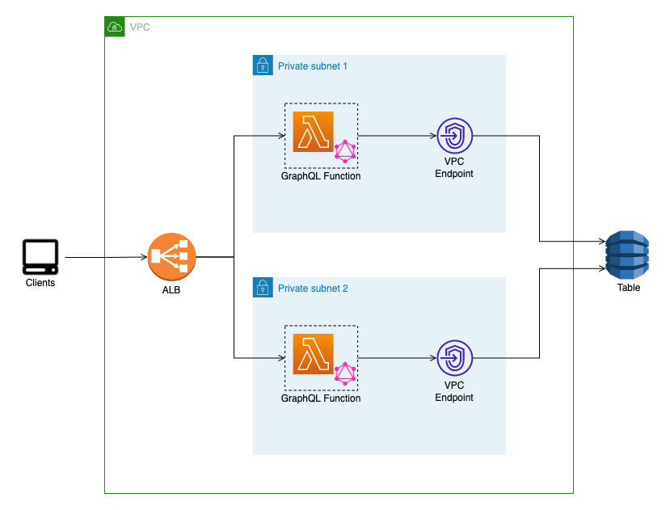
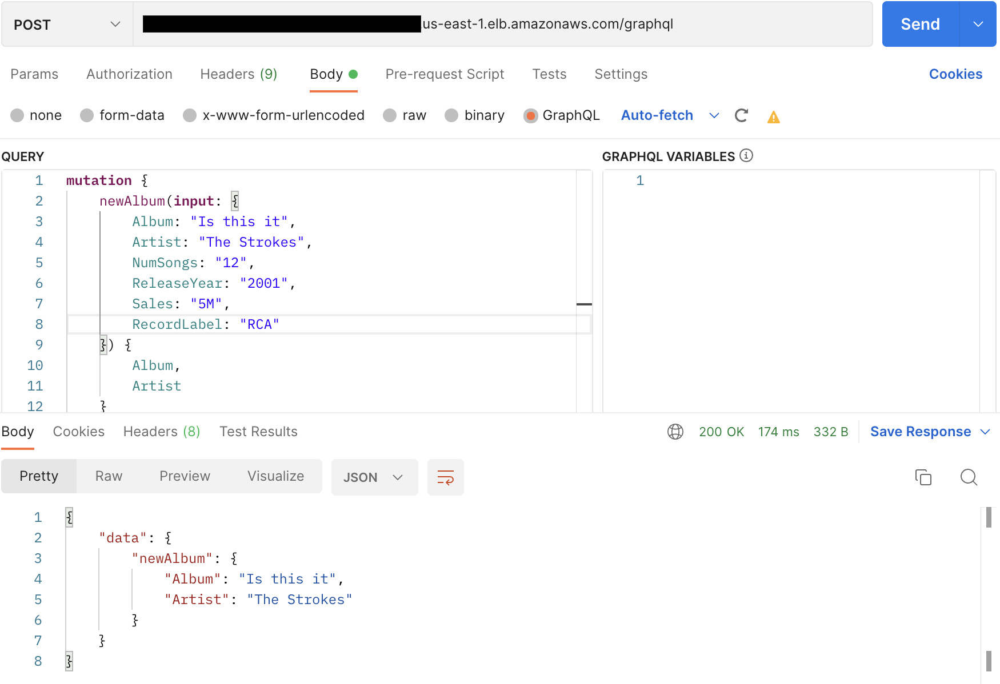
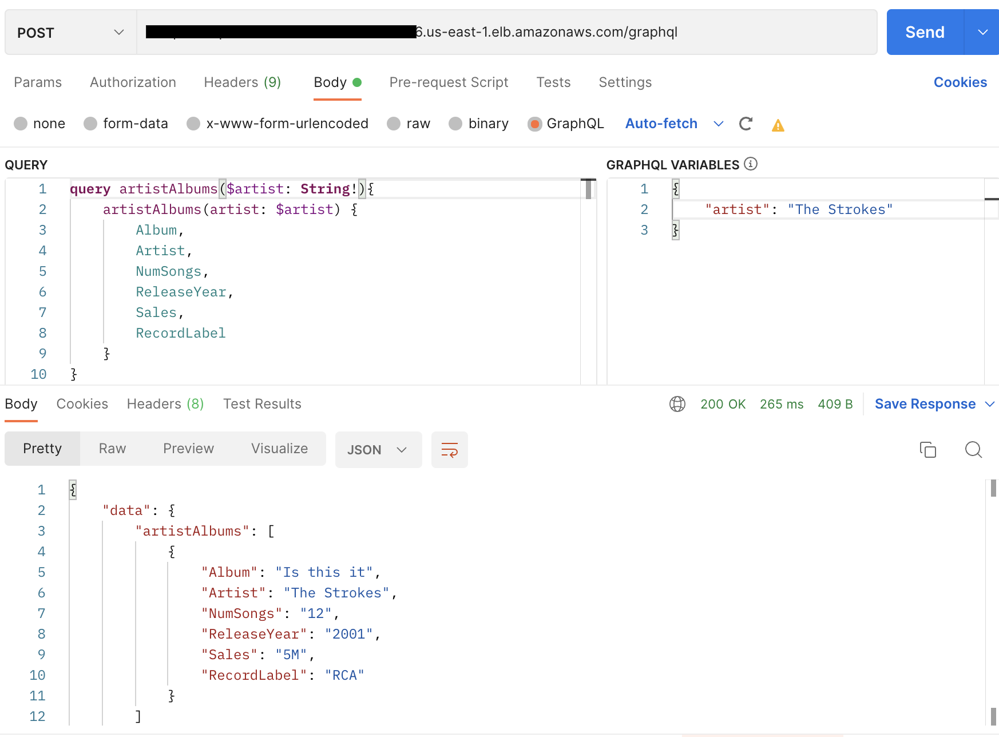

# Apollo-Server-Lambda

This's an application to run a GraphQL server in a Lambda function using the [apollo-server-lambda](https://www.apollographql.com/docs/apollo-server/integrations/middleware#apollo-server-lambda) package. 

Usually, you use AppSync whenever you need to run a GraphQL server in AWS. However, there're cases where the company policies require that the applications run inside a VPC. This project shows one solution where the GraphQL server runs on a Lambda function and the clients connect to it through an application load balancer (ALB). 

### Architecture

### Repo Structure

    .
    ├── graphql-server                 # Lambda application code                     
    |   |
    |   |── lambda                     # Stores transformed item in DynamoDB
    |   |   |── index.ts               # Code for Lambda handler       
    |   |   |── schema.ts              # GraphQL schema
    |   |   |── resolvers.ts           # GraphQL resolvers
    |   |── cdk.ts                     # CDK construct with API resources and Lambda function                       
    |
    |── app.ts                         # Main CDK application (Constructs are imported here and deployed within Stacks)
    └── ...

### How to deploy

1. `npm install`
2. `npm run cdk deploy`

**Important** - Please notice that in the CDK code the load balancer is configured `internet-facing`, but this only because I wanted to test the connections from my computer. It should really be an internal ALB.

In the screenshots below you can see examples for query and mutation operations in the deployed GraphQL server.

    
    

### Useful commands

* `npm run build`   compile typescript to js
* `npm run watch`   watch for changes and compile
* `npm run test`    perform the jest unit tests
* `cdk deploy`      deploy this stack to your default AWS account/region
* `cdk diff`        compare deployed stack with current state
* `cdk synth`       emits the synthesized CloudFormation template
